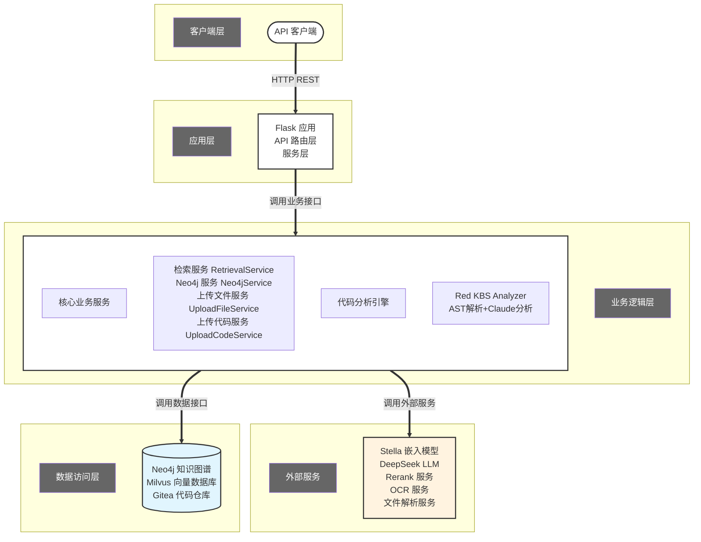
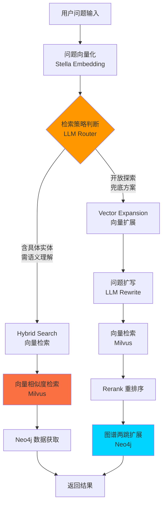
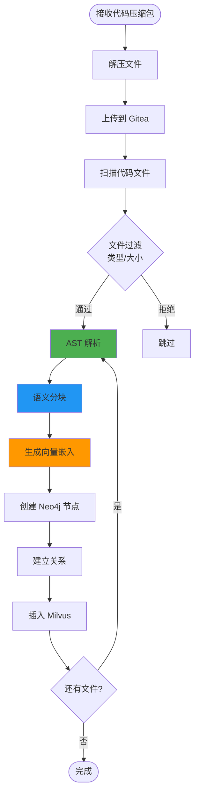
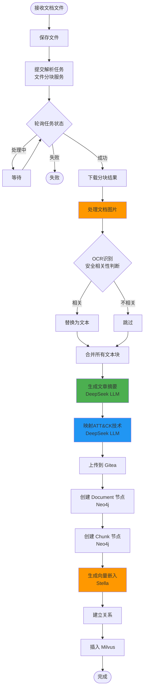
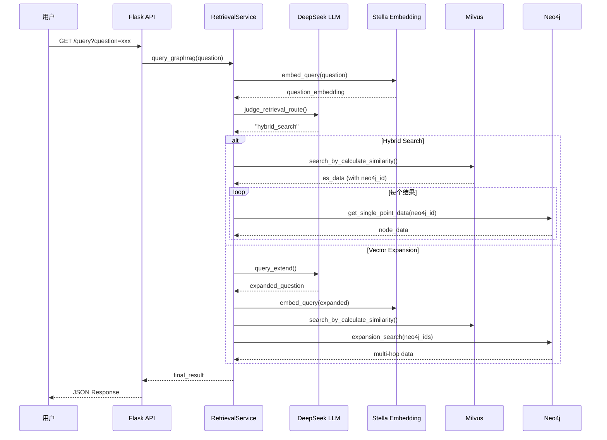
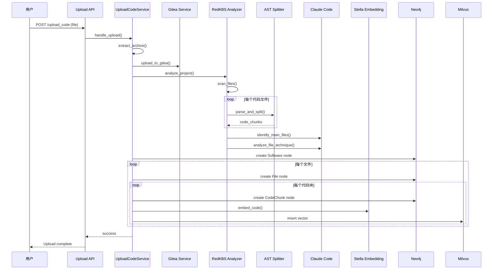

# Red Team Graph RAG 项目设计文档

## 1. 项目概述

### 1.1 项目简介
**Red Team Graph RAG** 是一个基于图数据库的网络安全知识检索增强生成（RAG）系统，专注于 MITRE ATT&CK 框架知识的智能化检索。系统结合向量检索、图数据库查询和大语言模型技术，为红队操作提供智能化的知识查询和分析能力。

### 1.2 核心特性
- **混合检索策略**: 结合向量检索和图数据库查询的多策略智能检索
- **MITRE ATT&CK 集成**: 完整集成战术、技术、软件、文章等知识图谱
- **代码分析能力**: 支持红队工具代码的自动分析和关联
- **智能召回**: 基于问题类型的智能检索路由选择
- **图扩展搜索**: 支持图谱两跳邻居查询的关联检索

### 1.3 技术栈
- **后端框架**: Flask + Gunicorn
- **图数据库**: Neo4j (MITRE ATT&CK 知识图谱)
- **向量数据库**: Milvus (向量相似度检索)
- **全文检索**: Elasticsearch (已迁移至 Milvus BM25)
- **嵌入模型**: Stella (自定义嵌入服务)
- **大语言模型**: DeepSeek Chat, Qwen
- **代码分析**: Tree-sitter (AST解析)

---

## 2. 系统架构

### 2.1 整体架构图



### 2.2 分层架构说明

#### 2.2.1 客户端层
- **API 客户端**: RESTful API 调用

#### 2.2.2 应用层
- **Flask 应用**: Web 框架核心 ([create_app.py](create_app.py))
- **API 路由**: RESTful API 端点定义
  - [retrieval_route.py](routes/retrieval_route.py): 查询路由
  - [neo4j_route.py](routes/neo4j_route.py): 图谱查询路由
  - [upload_file_route.py](routes/upload_file_route.py): 文件上传路由
  - [upload_code_route.py](routes/upload_code_route.py): 代码上传路由

#### 2.2.3 服务层
- **检索服务** ([service/retrieval_service.py](service/retrieval_service.py)): 核心检索逻辑
- **Neo4j 服务** ([service/neo4j_service.py](service/neo4j_service.py)): 图谱操作
- **上传文件服务** ([service/upload_file_service.py](service/upload_file_service.py)): 文档处理
- **上传代码服务** ([service/upload_code_service.py](service/upload_code_service.py)): 代码分析

#### 2.2.4 数据访问层
- **Neo4j Helper** ([database_helper/neo4j_helper.py](database_helper/neo4j_helper.py)): 图数据库操作封装
- **ES/Milvus Helper** ([database_helper/es_helper.py](database_helper/es_helper.py)): 向量检索封装

#### 2.2.5 分析引擎
- **Red KBS Analyzer** ([red_kbs_analyzer/](red_kbs_analyzer/)): 代码分析核心
  - AST Splitter: 代码语义分割
  - Claude Code: LLM 驱动的代码分析

---

## 3. 核心模块设计

### 3.1 检索服务 (RetrievalService)

#### 3.1.1 检索流程概述

检索服务采用智能路由策略，根据用户问题的特征自动选择最合适的检索方式，确保检索结果的准确性和全面性。

**核心流程：**

1. **问题向量化**：使用 Stella 嵌入模型将用户问题转换为高维向量表示

2. **智能策略判断**：通过 DeepSeek LLM 分析问题语义，自动选择检索策略：
   - **Hybrid Search（混合检索）**：适用于包含具体实体且需要深度语义理解的问题
   - **Vector Expansion（向量扩展）**：适用于开放探索性问题，作为兜底策略
   - **Graph Search（图谱搜索）**：适用于明确关系或路径查询（规划中）

3. **执行检索**：
   - **Hybrid Search 路径**：直接进行向量相似度检索 → 从 Milvus 获取候选结果 → 根据 neo4j_id 从 Neo4j 获取完整图谱数据
   - **Vector Expansion 路径**：LLM 问题扩写 → 扩写问题向量化 → 向量检索 → Rerank 重排序（Top-K）→ 图谱两跳扩展查询

4. **结果返回**：将检索结果组织为层级化的 JSON 格式返回给客户端


#### 3.1.2 检索策略架构



### 3.2 Neo4j 服务设计

#### 3.2.1 核心节点类型

| 节点类型 | 说明 | 关键字段 |
|---------|------|---------|
| `MitreAttackTactic` | 战术 (如 TA0001 Reconnaissance) | attack_id, name, description |
| `MitreAttackTechnique` | 技术/子技术 | attack_id, name, description |
| `MitreAttackArticleDocument` | 文章文档 | title, article_summary, source_url |
| `MitreAttackArticleChunk` | 文章分块 | description, source_url |
| `MitreAttackCodeSoftware` | 红队工具软件 | name, description, repo_url |
| `MitreAttackCodeSoftwareFile` | 代码文件 | file_uuid, name |
| `MitreAttackCodeSoftwareCodeChunk` | 代码块 | code_data, technique_id, chunk_start_line |
| `MitreAttackCampaign` | 攻击活动 | name, description |
| `MitreAttackGroup` | 威胁组织 | name, description |
| `MitreAttackMitigation` | 缓解措施 | name, description |

#### 3.2.2 动态字段返回

```python
# setting.py:60-72
NODE_RETURN_FIELDS = {
    "MitreAttackArticleChunk": ["description", "source_url", "repo_url"],
    "MitreAttackArticleDocument": ["insert_type", "procedure_examples_id", ...],
    "MitreAttackTactic": ["attack_id", "attack_shortname", "description", ...],
    # ... 其他节点类型
}
```

### 3.3 代码上传流程

#### 3.3.1 代码处理流程



#### 3.3.2 AST 代码分割

**核心文件**: [red_kbs_analyzer/core/ast_splitter.py](red_kbs_analyzer/core/ast_splitter.py)

**特点:**
- 基于 Tree-sitter 的语法树解析
- 语义感知的代码分块 (而非简单按行分割)
- 保持函数/类的完整性
- 支持多种编程语言

#### 3.3.3 Claude 代码分析

**核心文件**: [red_kbs_analyzer/core/claude_code.py](red_kbs_analyzer/core/claude_code.py)

**功能:**
- 识别核心文件
- 分析文件与 MITRE ATT&CK 技术的关联
- 生成项目摘要
- 提取战术和技术标签

#### 3.3.4 数据写入流程
1. 创建 Software 节点
2. 为每个文件创建 File 节点
3. 为每个代码块创建 CodeChunk 节点
4. 建立节点间的关系
5. 生成代码块向量嵌入
6. 同步写入 Milvus 集合

### 3.4 文件上传流程

#### 3.4.1 文件处理流程



#### 3.4.2 文件解析与分块

**核心文件**: [service/upload_file_service.py](service/upload_file_service.py)

**支持的文件类型**:
- 文档类: `.pdf`, `.docx`, `.doc`, `.txt`, `.md`, `.pptx`, `.xlsx`
- 图片类: `.jpg`, `.png`

**处理流程**:
1. **任务提交** ([`submit_task_to_parse`](service/upload_file_service.py:91)): 调用文件解析服务,按类型分块
2. **参数配置**:
   - `chunk_size`: 2048 字符
   - `chunk_overlap`: 512 字符
3. **结果下载** ([`download_file_data`](service/upload_file_service.py:128)): 轮询任务状态并下载 JSON 格式的分块结果

**分块数据结构**:
```json
{
  "chunks_list": [
    {
      "content": "文本内容或图片base64",
      "metadata": {
        "chunk_id": "唯一标识",
        "chunk_number": 1,
        "chunk_type": "text|image"
      }
    }
  ]
}
```

#### 3.4.3 图片处理与OCR

**功能**: 识别文档中的图片并提取安全相关信息

**处理流程**:

1. **图片识别** ([`get_picture_data_by_ocr`](service/upload_file_service.py:205))
   - 调用 OCR 服务提取图片文本
   - 支持多种图片格式

2. **安全相关性判断** ([`judge_data_about_safe`](service/upload_file_service.py:152))
   - 使用 DeepSeek LLM 判断 OCR 内容是否与安全相关
   - 相关性判断包括: 安全知识、攻击代码、命令行命令等
   - 返回 `sign=1` (相关) 或 `sign=0` (不相关)

3. **内容处理**:
   - **相关图片**: 将 OCR 文本替换图片内容 (`safe_sign=1`)
   - **无关图片**: 从分块列表中删除 (`delete_image_sign`)

**关键特性**:
- 自动过滤无关图片,减少噪音数据
- 保留图片中的关键安全信息
- 提升文档检索质量

#### 3.4.4 智能分析与映射

**1. 文档摘要生成** ([`get_all_documents_summary`](service/upload_file_service.py:382))

- **分段总结**: 将文档按 token 限制分段,逐段生成摘要
- **汇总总结**: 将所有分段摘要再次汇总,生成最终摘要
- **安全聚焦**: 优先识别和总结安全相关知识、技术手段、攻击流程
- **输出长度**: 约 2000 字

**2. 技术映射** ([`map_document_to_technical`](service/upload_file_service.py:467))

- **分段分析**: 使用 LLM 分析每个文档分段
- **技术识别**: 识别文档中涉及的 MITRE ATT&CK 技术ID
- **相关性评分**: 对每个技术进行相关性评分 (`relevance`)
- **文本存在性**: 判断文档中是否包含该技术的具体描述 (`have_text`)
- **筛选条件**: 仅保留 `relevance >= 0.9` 且 `have_text=true` 的技术

**映射结果示例**:
```python
{
  "result": True,
  "ttps": [
    {
      "technique_id": "T1059.001",
      "relevance": 0.95,
      "have_text": true
    }
  ]
}
```

#### 3.4.5 数据写入流程

**1. Gitea 文件上传**
- 为每个文件创建独立仓库
- 仓库名称规范化: 小写字母、数字、连字符和下划线
- 支持文档格式转换 (`.docx` → `.pdf`)

**2. Neo4j 数据写入**

a) **创建 Document 节点** ([`insert_neo4j_document_data_without_embedding`](service/upload_file_service.py:497))
   - 节点类型: `MitreAttackArticleDocument`
   - 关键字段:
     - `title`: 文档标题
     - `article_summary`: 文档摘要
     - `full_text`: 完整文本
     - `mitre_attack_id_list`: 关联的技术ID列表
     - `repo_url`: Gitea 仓库地址

b) **创建 Chunk 节点** ([`insert_neo4j_chunk`](service/upload_file_service.py:574))
   - 节点类型: `MitreAttackArticleChunk`
   - 关键字段:
     - `chunk_id`: 分块唯一标识
     - `chunk_index`: 分块索引
     - `description`: 分块内容
     - `description_embedding`: 内容向量嵌入

c) **建立关系**:
   - Document ⇄ Chunk: `DOCUMENT_HAS_CHUNK` / `CHUNK_BELONG_TO_DOCUMENT`
   - Document ⇄ Technique: `DOCUMENT_BELONG_TECHNIQUE` / `TECHNIQUE_HAS_DOCUMENT`

**3. Milvus 向量写入** ([`add_milvus`](service/upload_file_service.py:903))

- 从 Neo4j 查询所有 Chunk 节点的向量数据
- 批量插入到 Milvus 集合
- 字段映射:
  - `neo4j_id`: Neo4j 节点ID
  - `code_data`: 分块内容 (全文检索)
  - `description`: 分块描述
  - `code__embedding`: 1024维向量 (COSINE 相似度)
  - `sparse_vector`: BM25 稀疏向量
  - `soft_name`: 原始文件名
  - `url`: Gitea 文件地址

---

## 4. API 接口设计

### 4.1 检索 API

#### GET /rag_api/query
**功能**: Graph RAG 智能检索

**请求参数**:
- `question` (string): 用户问题

**响应示例**:
```json
{
  "code": "200",
  "data": [
    {
      "node_label": "MitreAttackTechnique",
      "attack_id": "T1003",
      "name": "OS Credential Dumping",
      "description": "...",
      "next_level": [...]
    }
  ],
  "message": "success"
}
```

### 4.2 Neo4j 查询 API

#### GET /rag_api/get_description_by_id
获取战术/技术描述

#### GET /rag_api/get_data_by_id
根据 MITRE ID 获取相关文章和软件

#### GET /rag_api/get_detail_by_ids
批量获取节点详情

#### GET /rag_api/count
获取文章和软件统计

#### GET /rag_api/get_all_articles
分页获取文章列表

#### GET /rag_api/get_all_software
分页获取软件列表

#### GET /rag_api/get_software_techniques_tactics
获取软件关联的战术和技术

### 4.3 上传 API

#### POST /rag_api/upload_file
上传文档文件并处理

#### POST /rag_api/upload_code
上传代码文件并分析

---

## 5. 数据流程

### 5.1 查询数据流



### 5.2 代码上传数据流


---

## 6. 部署架构

### 6.1 Docker 部署

**Docker Compose 服务**:
```yaml
services:
  neo4j:
    image: neo4j:latest
    ports: ["7687:7687", "7474:7474"]

  app:
    build: .
    ports: ["5010:5010"]
    depends_on: [neo4j]
```

### 6.2 生产部署

- **WSGI 服务器**: Gunicorn ([app_for_gunicorn.py](app_for_gunicorn.py))
- **应用端口**: 5010
- **Python 版本**: 3.13.2

---

## 7. 数据模型

### 7.1 图数据库关系

```cypher
// 战术 - 技术
(:MitreAttackTactic)-[:HAS_TECHNIQUE]->(:MitreAttackTechnique)

// 技术 - 代码块
(:MitreAttackTechnique)-
[:IMPLEMENTED_BY]->(:MitreAttackCodeSoftwareCodeChunk)

// 软件 - 文件 - 代码块
(:MitreAttackCodeSoftware)-[:HAS_FILE]->(:MitreAttackCodeSoftwareFile)
(:MitreAttackCodeSoftwareFile)-[:HAS_CHUNK]->(:MitreAttackCodeSoftwareCodeChunk)

// 技术 - 文章
(:MitreAttackTechnique)-[:MENTIONED_IN]->(:MitreAttackArticleChunk)
(:MitreAttackArticleDocument)-[:CONTAINS]->(:MitreAttackArticleChunk)
```

### 7.2 向量数据库模式

**Milvus Collection: es_migration_new**

| 字段 | 类型 | 说明 |
|------|------|------|
| `id` | INT64 | 主键 |
| `neo4j_id` | VARCHAR | Neo4j 节点 ID |
| `code_data` | VARCHAR | 代码内容 (全文检索字段) |
| `description` | VARCHAR | 描述文本 |
| `code__embedding` | FLOAT_VECTOR | 代码向量嵌入 (1536维) |
| `sparse_vector` | SPARSE_FLOAT_VECTOR | BM25 稀疏向量 |

**索引:**
- 向量索引: COSINE 相似度
- 全文索引: BM25

---
### 7.3 日志记录
使用自定义日志模块 ([red_kbs_analyzer/run_logs/logger.py](red_kbs_analyzer/run_logs/logger.py))

---
## 8. 项目文件结构

```
red-team-graph-rag/
├── app_for_gunicorn.py          # Gunicorn WSGI 入口
├── create_app.py                # Flask 应用工厂
├── setting.py                   # 全局配置
├── requirements.txt             # Python 依赖
├── docker-compose.yml           # Docker 编排
├── Dockerfile                   # 镜像构建
│
├── routes/                      # API 路由层
│   ├── retrieval_route.py       # 检索 API
│   ├── neo4j_route.py           # 图谱查询 API
│   ├── upload_file_route.py     # 文件上传 API
│   └── upload_code_route.py     # 代码上传 API
│
├── service/                     # 业务服务层
│   ├── retrieval_service.py     # 检索服务 (10KB)
│   ├── neo4j_service.py         # Neo4j 服务 (18KB)
│   ├── upload_file_service.py   # 文件上传服务 (45KB)
│   └── upload_code_service.py   # 代码上传服务 (60KB)
│
├── database_helper/             # 数据访问层
│   ├── neo4j_helper.py          # Neo4j 客户端
│   └── es_helper.py             # Milvus 客户端
│
├── red_kbs_analyzer/            # 代码分析引擎
│   ├── core/
│   │   ├── analyzer.py          # 分析器核心 (44KB)
│   │   ├── ast_splitter.py      # AST 代码分割 (17KB)
│   │   └── claude_code.py       # Claude 代码分析 (37KB)
│   ├── models/
│   │   ├── project.py           # 项目模型
│   │   └── analysis.py          # 分析结果模型
│   └── run_logs/
│       └── logger.py            # 日志模块
│
├── utils/                       # 工具模块
│   ├── prompts.py               # LLM Prompt 模板
│   └── map_prompt.py            # 扩展 Prompt (27KB)
│
├── gitea_service/               # Gitea 集成
├── check/                       # 数据验证脚本
├── batch_import*.py             # 批处理脚本
└── docs/                        # 文档目录
    └── PROJECT_DESIGN.md        # 本文档
```

---

## 9. 总结

### 9.1 核心优势
1. **多策略智能检索**: LLM 驱动的检索路由
2. **图谱增强**: Neo4j 知识图谱提供关联查询能力
3. **代码理解**: AST + LLM 的深度代码分析
4. **高性能**: Milvus 向量数据库 + 批量并发处理

### 9.2 应用场景
- 红队工具知识检索
- MITRE ATT&CK 框架查询
- 攻击技术代码关联分析
- 威胁情报知识图谱查询

### 9.3 未来扩展方向
- 支持更多检索策略 (如 GraphQA)
- 增强图谱推理能力
- 支持更多代码语言
- 优化向量检索效率
- 增加用户反馈学习机制
